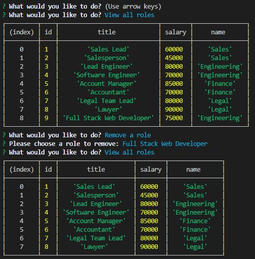
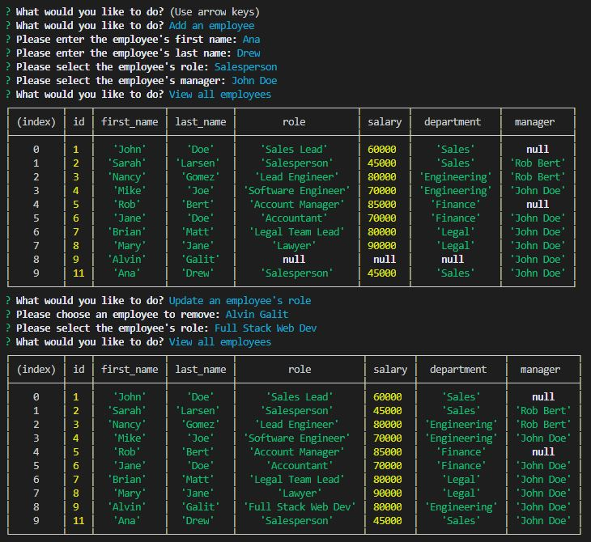
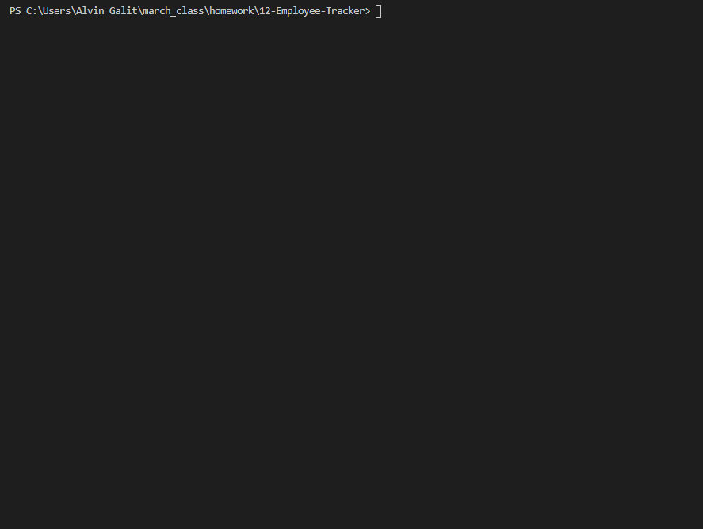

# 12 Employee Tracker
> Command line interface for tracking employees within a company.

This was a homework assignment where we were challenged to architect and build a solution for managing a company's employees using node, inquirer, and MySQL.

## Completed
* Design the following database schema containing three tables:
    
* Build a command-line application that at a minimum allows the user to:
  * Add departments, roles, employees
  * View departments, roles, employees
  * Update employee roles
  * Update employee managers
  * View employees by manager
  * Delete departments, roles, and employees
  * View the total utilized budget of a department -- ie the combined salaries of all employees in that department
* Use the [MySQL](https://www.npmjs.com/package/mysql) NPM package to connect to your MySQL database and perform queries.
* Use [InquirerJs](https://www.npmjs.com/package/inquirer/v/0.2.3) NPM package to interact with the user via the command-line.

## User Story  
```
As a business owner
I want to be able to view and manage the departments, roles, and employees in my company
So that I can organize and plan my business
```

## Screenshots  
 
 

## Animated GIF  

